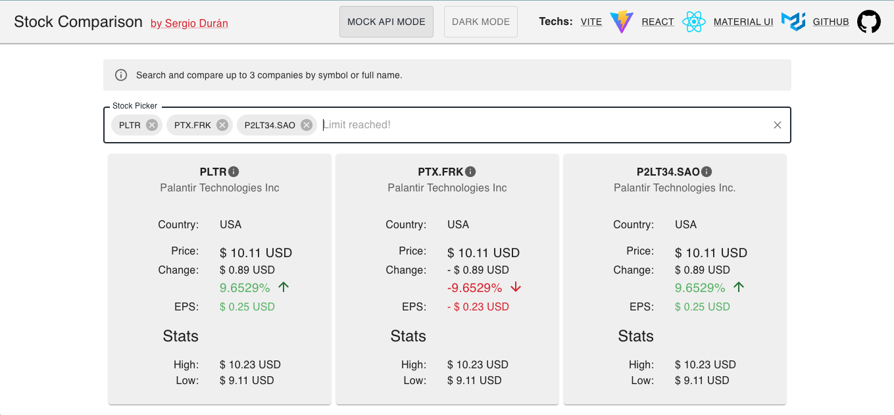
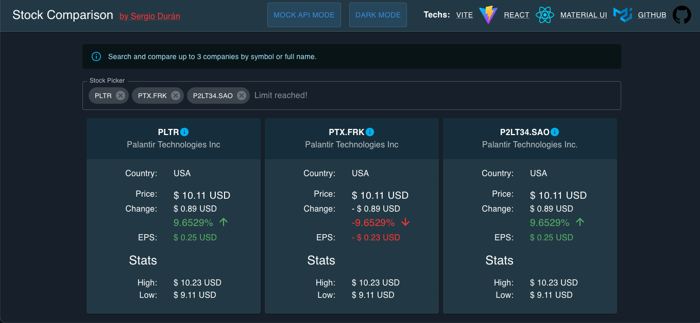

# Summary

This is a "Stock Comparing" app exercise created by [Sergio Durán](https://www.linkedin.com/in/xduranmtz/) for demo purposes.

**Light mode**

**Dark mode**

## Techs

- Vite
- React
- Typescript
- Material UI
- SCSS
- Jest
- Cypress

## Run

`npm i && npm run dev`

- node >= 16
- npm >= 8

## Run Unit & Integration tests

`npm i && npm run test`

## Run E2E tests

`npm i && npm run cypress`

or

`npm i && npm run cypress:open`

## Format

- Prettier

## Features

- Themes: dark, light
- Stock comparison
- API Mock mode

## To Know

- Alpha Vantage API has a limited free version, so, consider this limitation when performing actions like selecting several items quickly.
- Not all stocks have overview details, e.g. the ones with a period in the symbol. 

## TODOs

- i18n/l10n
- a11y (aria, htmlFor)
- deep links - url params
- CI
- Deployment
- refactor stocks hooks with context provider

## TODOs

- extend unit tests coverage
- extend integration tests coverage
- extend e2e tests
